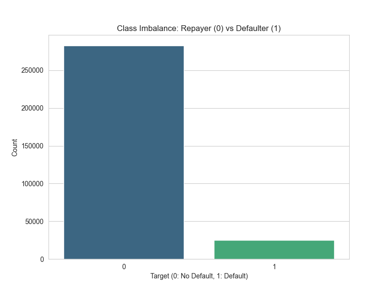
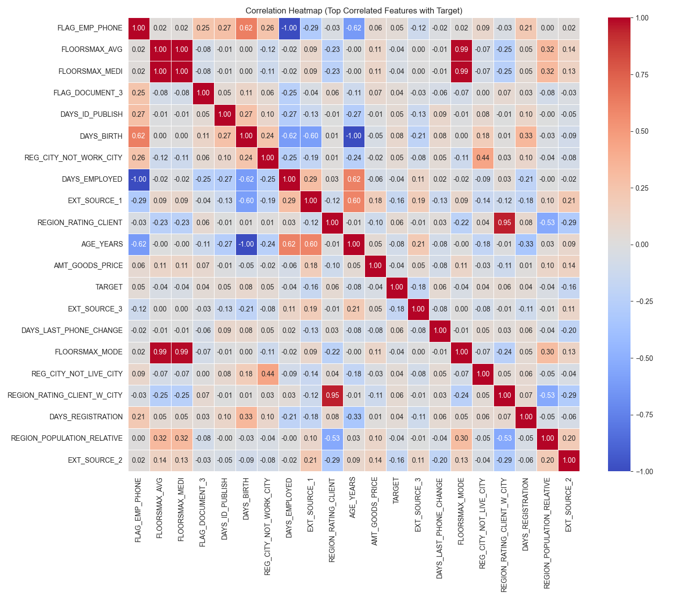
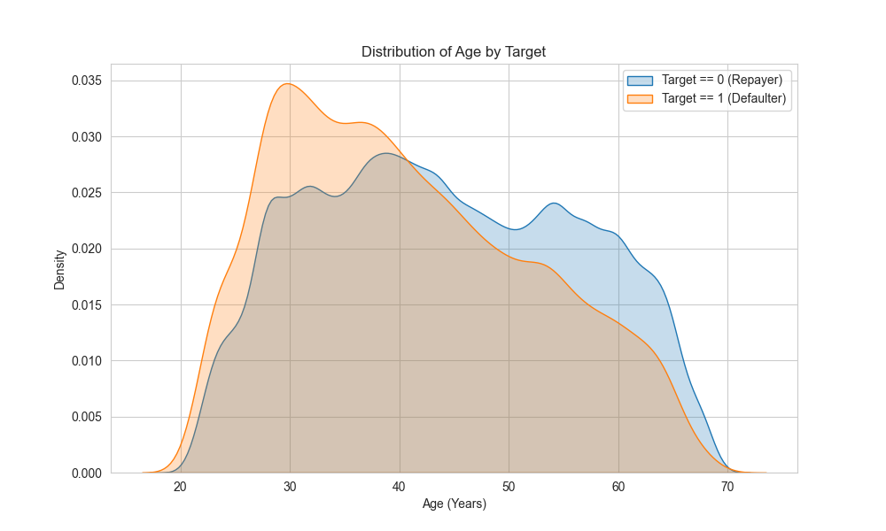
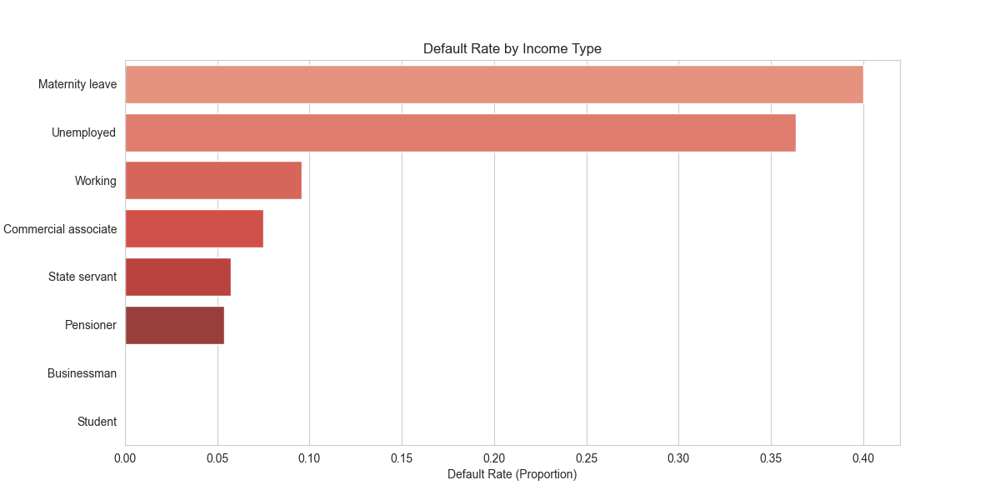
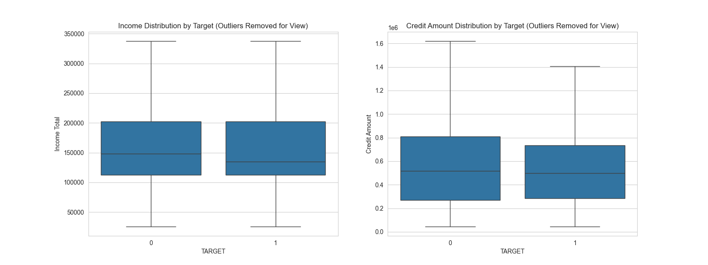
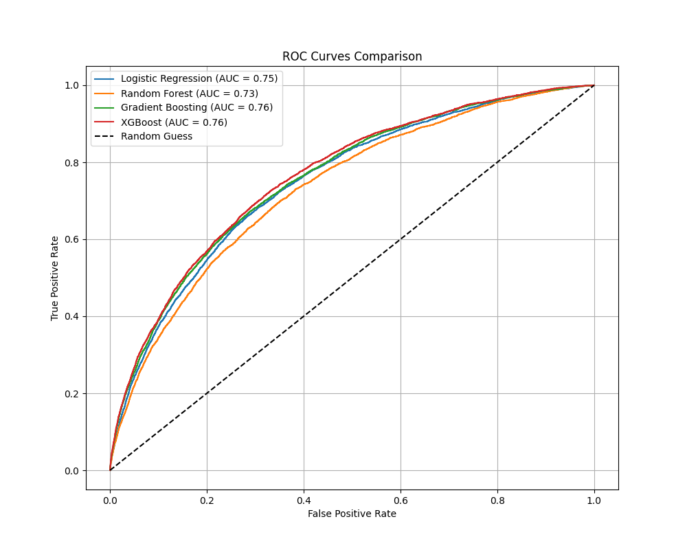

# Credit Risk Prediction System - Project Summary

## 1. Problem Statement

The goal of this project is to develop a machine learning model to predict the likelihood of a client defaulting on a loan. Financial institutions need to accurately assess credit risk to minimize losses while ensuring credit is available to eligible borrowers. This system analyzes client data to classify applicants as either "Low Risk" or "High Risk" of default.

## 2. Dataset Explanation

- **Source:** Home Credit Default Risk dataset.
- **Main File:** `application_train.csv` (processed into `processed_train.csv`).
- **Target Variable:** `TARGET` (0 = Repaid, 1 = Default).
- **Key Features:**
  - **Demographics:** Gender, Age, Education, Family Status.
  - **Financials:** Income, Credit Amount, Annuity.
  - **External Sources:** Normalized scores from external data sources (`EXT_SOURCE_1`, `EXT_SOURCE_2`, `EXT_SOURCE_3`).

_Figure 1: Distribution of Target Variable showing severe class imbalance._

## 3. Preprocessing Steps

To prepare the data for modeling, the following steps were taken:

1.  **Feature Engineering:**
    - Converted `DAYS_BIRTH` to `AGE_YEARS`.
    - Created financial ratios: `DEBT_TO_INCOME_RATIO`, `CREDIT_TO_INCOME_RATIO`.
2.  **Encoding:** Applied One-Hot Encoding to categorical variables (e.g., Education, Gender).
3.  **Handling Imbalance:** The dataset is highly imbalanced (far fewer defaults than repayments). We implemented **SMOTE (Synthetic Minority Over-sampling Technique)** to generate synthetic examples for the minority class, ensuring the model learns default patterns effectively.
4.  **Scaling:** Numerical features were normalized where appropriate, though tree-based models like XGBoost handle unscaled data well.

## 4. Visualizations

We developed an interactive dashboard to visualize the data and model decisions:

- **Feature Distribution:** Comparisons of applicant income and credit against the population average.
- **Risk Score Display:** A gauge-like metric showing the probability of default.
- **Feature Importance:** Understanding which factors (e.g., External Sources, Debt Ratio) contributed most to the risk score.

### Key Visual Insights

_Figure 2: Correlation Heatmap revealing relationships between features._

_Figure 3: Age Distribution by Target - Younger applicants show slightly higher default risk._

_Figure 4: Default Rates across different Income Types._

_Figure 5: Boxplots showing distribution and outliers of key numeric features._

## 5. Algorithms Used

We evaluated multiple approaches, focusing on:

- **XGBoost Classifier:** A powerful gradient boosting algorithm chosen for its efficiency and performance on structured tabular data.
- **Techniques:**
  - **Class Weighting:** Adjusting the model's loss function to penalize missing defaults more heavily.
  - **SMOTE + XGBoost:** Training the classifier on the oversampled balanced dataset.
  - **Threshold Tuning:** Moving the decision boundary from the default 0.5 to an optimal value (approx. 0.17) to maximize the F1-Score.

## 6. Performance Comparison

The final model (XGBoost + SMOTE) achieved the following metrics on the validation set:

| Metric        | Value      | Interpretation                                                                                           |
| :------------ | :--------- | :------------------------------------------------------------------------------------------------------- |
| **ROC-AUC**   | **0.7458** | Good discriminative ability between defaulters and non-defaulters.                                       |
| **Accuracy**  | 0.8359     | Correctly classified 83.6% of applicants.                                                                |
| **Precision** | 0.2225     | Of those flagged as high risk, 22% actually defaulted (typical in high-imbalance scenarios).             |
| **Recall**    | **0.4143** | Captured 41.4% of all actual defaulters (significant improvement over baseline accuracy-focused models). |
| **F1 Score**  | 0.2896     | Harmonic mean of precision and recall.                                                                   |

_Note: The optimized decision threshold was set to **0.1727** to prioritize capturing potential defaulters (Recall) while maintaining reasonable precision._

_Figure 5: ROC Curve Comparison of different models._

## 7. Deployment Details

The solution was deployed as a web application using **Streamlit**:

- **Interface:** User-friendly sidebar for entering applicant details (Income, Age, External Scores).
- **Real-time Inference:** The app loads the trained XGBoost model (`xgboost_optimized.json`) and calculates risk scores instantly.
- **Decision Support:** Provides a clear "Safe" or "High Risk" recommendation based on the calculated probability and threshold.

## 8. Learning Outcomes and Challenges

- **Imbalanced Data:** Simply maximizing accuracy is misleading in credit risk. We learned to prioritize **Recall** and **ROC-AUC** and use techniques like SMOTE and Class Weights.
- **Feature Importance:** discovered that `EXT_SOURCE` features were highly predictive, often outweighing income alone.
- **Threshold Moving:** We faced the challenge that the default 0.5 threshold missed too many defaulters. Tuning the threshold was critical for a viable business tool.
- **Deployment:** Bridging the gap between a static notebook and a live, interactive tool highlighted the importance of model serialization/saving and input data preprocessing pipelines.
